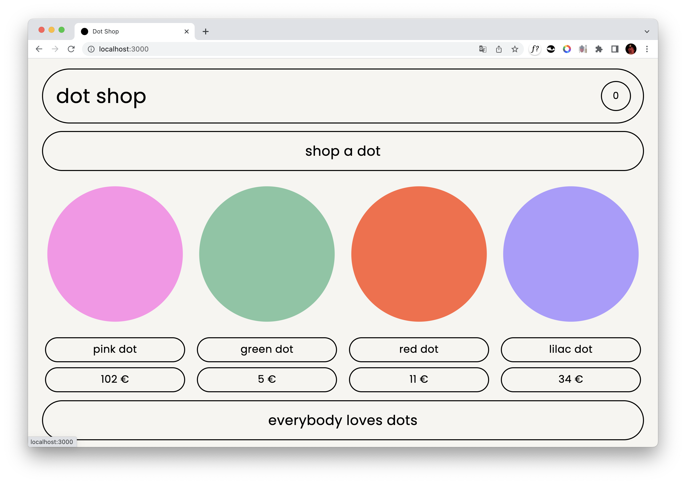
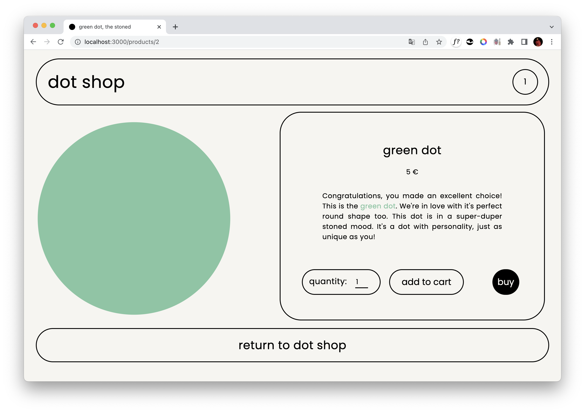

# ⚫ dot shop, Next.js e-commerce store

everybody loves dots! and in this e-commerce store you can purchase them for your happyness!

this is a full-stack application using cookies. it is only a simulation of an online webstore, while including all proper functions:

- a landingpage with all the available products (dots) listed
- the user can browse through the different product-pages and add a selected amount of dots to the cart
- the amount of dots in the cart is always visible in the header
- on the cart page, the user can change or remove the dots from the cart
- the user can find the total on the checkout page and fill out all the shipping infos

this is a desktop version btw - please look at it on a screen width bigger than 1240 px!

## Technologies used

**Client:** Next.js, React, TypeScript, Jest, Playwright, styled Components

**Server:** Node.js, PostgreSQL

## Sreenshots

### Landingpage



### Product page



## Setup guide

To run this project locally, the following steps are needed:

1. Clone this repo on your local machine and connect to your GitHub account

2. Download and install PostgreSQL (if not installed yet).

- https://www.postgresql.org/download/

3. Create a User and a Database for the project.

4. Create a copy of the `.env.example` on the root of the project and modify it with your credentials. The file should include these four environment variables:

- PGHOST=localhost
- PGDATABASE=\<nameOfYourDatabase>
- PGUSERNAME=\<nameOfYourUsername>
- PGPASSWORD=\<nameOfYourPassword>

5. Rename this file to .env .
6. On the command Line go to the project directory and install the required dependencies with:

```bash
yarn
```

7. Install the dotenv-cli globally with:

```bash
yarn global add dotenv-cli
```

8. Run the migrations for your local database with:

```bash
yarn migrate up
```

9. Start the server with:

```bash
yarn dev
```

## Deployment instructions

The following instructions can be used to deploy the application online using Heroku:

1. Create a repository with your version of the app.
2. Sign up on Heroku: https://signup.heroku.com/ and create an account
3. Create a new App with your preferred name
4. Choose a name and select your region
5. On "deploxment method", go to "Connect to GitHub" and select your repository
6. Click on the "Enable Automatic Deploys" button
7. Go back to the Overview tab and click on "Configure Add-On". Search for "Postgres" and select "Heroku Postgres" from the results
8. Trigger the deployment by pushing into your github repository
